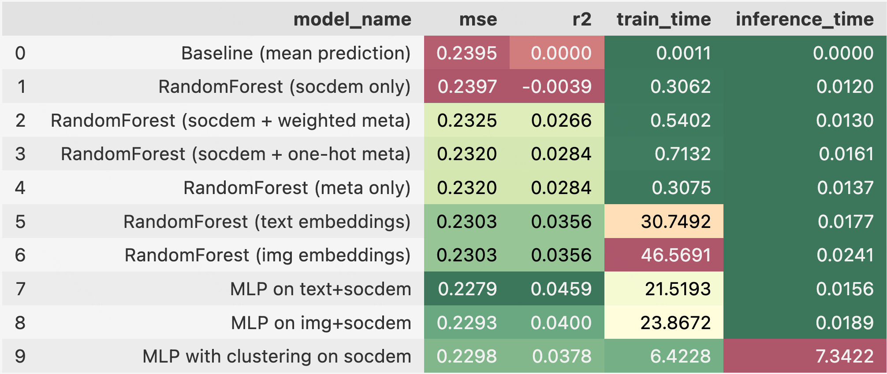

# RiskProfile

Этот проект строит индивидуальный портрет и риск-профиль инвестора на основе двух уровней признаков:

- **Демографические характеристики:** возраст, пол, образование, доход и другие социально-демографические данные
- **Скрытые психологические паттерны, извлекаемые через визуальные предпочтения**

---

## Генерация изображений

### Четыре ключевые оси личности:

| Ось           | Полярность         |
|---------------|--------------------|
| Безопасность  | Свобода            |
| Активность    | Расслабление       |
| Порядок       | Хаос               |
| Социальность  | Интроверсия        |


- Используется реализм во вселенной «Шрека» для отображения 16 сцен, представляющих различные сочетания значений по четырём осям (например, 1-1-2-2 <-> Безопасность-Активность-Хаос-Интроверсия и тд)

- Для создания датасета вводится safe choice (0-0-0-0) - нейтральное контрольное изображение
- Генерация: **API Google Gemini**

### Соответствие изображений: индекс — мета — полный prompt

| №  | Meta                | Prompt |
|----|---------------------|--------|
| 1  | S=1, A=1, O=1, I=1  | In the Shrek universe, cartoon realism style, orderly castle courtyard in Duloc. Uniformed knights march in sync. Donkey shouts commands like a sergeant. Lord Farquaad measures distance with a ruler. Clean pastel tones, precise geometry. |
| 2  | S=1, A=1, O=1, I=2  | Shrek trains alone in a tidy gym in Duloc. Punches a hanging straw dummy. Wall has schedule “Fight: 9am–5pm”. Outside — boring grey Duloc skyline. Shield on the wall, clean pastel lighting. |
| 3  | S=1, A=1, O=2, I=1  | In the Duloc throne room, total chaos after party. Broken dishes, sleeping princess on chandelier, Donkey DJs on table. Shrek in guard armor facepalms. Warm lighting, red carpets, messy royal room. |
| 4  | S=1, A=1, O=2, I=2  | Shrek alone in a dark dungeon under the castle. Debris from broken cages, graffiti “Puss was here” on wall. Shield leaned against rocks. Torchlight creates dramatic shadows. |
| 5  | S=1, A=2, O=1, I=1  | Lord Farquaad drinks tea in a large hall with empty guest chairs. Behind window — dull military parade. Tea set, cookies, banner “Order is Power”. Soft light, pale pastel colors. |
| 6  | S=1, A=2, O=1, I=2  | Shrek sits in Duloc library reading “How to Be Human”. Neatly arranged bookshelves. Cozy brown carpet with Duloc emblem. Warm lamp light. Coffee cup on floor. |
| 7  | S=1, A=2, O=2, I=1  | After a royal party, everyone sleeps in random places. Donkey hugs a keg. Shrek snoring in crown. Half-fallen Duloc banners. Royal room in disarray, warm tones. |
| 8  | S=1, A=2, O=2, I=2  | Shrek naps alone in a royal carriage under a blanket. Unicorns slowly pull it through forest. A “Slow!” sign on back. Books and tea cup scattered inside. |
| 9  | S=2, A=1, O=1, I=1  | Shrek, Fiona and Donkey race playfully through the swamp. Makeshift flags, energetic motion. House visible in background. Cartoon-realistic lighting, rich greens. |
| 10 | S=2, A=1, O=1, I=2  | Shrek chopping wood neatly. Logs stacked in perfect pyramid. Fiona watching from window with book. Forest clearing, orderly and calm. Signpost: “Freedom in Effort”. |
| 11 | S=2, A=1, O=2, I=1  | Wild tavern party. Trolls dance on tables, Donkey sings loudly. Lights flicker. Mess everywhere. Wooden cups, spilled drinks. Swamp pub atmosphere. |
| 12 | S=2, A=1, O=2, I=2  | Shrek puts out burning house. Puss in Boots calmly washes himself nearby. Smoke fills scene. Fence says “No Entry”. Chaotic but personal. |
| 13 | S=2, A=2, O=1, I=1  | Cozy picnic at swamp. Fiona sets food, Donkey entertains piglets. Everything neatly laid out. Lanterns, blanket, food baskets. |
| 14 | S=2, A=2, O=1, I=2  | Shrek naps in hammock between trees. Bird holds “Do Not Disturb” sign. Perfectly trimmed grass. Puss in Boots asleep on book. |
| 15 | S=2, A=2, O=2, I=1  | Around a swamp campfire at night, Shrek, Donkey, Fiona, and Puss argue and laugh loudly. Fire reflects on faces. Cups and snacks scattered. |
| 16 | S=2, A=2, O=2, I=2  | Shrek lies peacefully in a puddle under rain. Frogs jumping on him. “Life is good” sign nearby. Calm, introspective, nature tones. |
| 17 | S=0, A=0, O=0, I=0  | Neutral Shrek-style scene. Everyone — Shrek, Fiona, Donkey, Puss — waiting quietly in line near outhouse. No action, no expression. Donkey stares at hourglass. Faint lighting, grayish tones. |

---

## Генерация данных

- `data/LLM_Preference_RealData.ipynb`
  
  Исследуется датасет [SCF 2022](https://www.federalreserve.gov/econres/scfindex.htm), проводится попытка использовать реальные анкеты как основу для генерации обучающих примеров
  
- `data/Synthetic_Data_Creation.ipynb`
  
  Сценарий генерации синтетических данных тремя способами:

  - _LLM-sampled_ - LLM полностью выдумывает личность

  - _LLM-sampled, recommended distribution_ — распределения призннаков описаны в промпте, но значения не заданы

  - _Pre-sampled_ - значения признаков сэмплируются заранее и передаются в LLM (основной рабочий метод проекта)

**Используемые модели:**

  - **T-pro-it-1.0** (10k выборка)

  - **GPT-4o** (меньшие сеты, подходы 1 и 3)

  - **DeepSeek-V2** (через OpenRouter)


**Источники данных по распределениям признаков**

- [«Determinants of Private Investors’ Behavior on Russian Stock Market», 2020](https://www.researchgate.net/publication/342400200_Determinants_of_Private_Investors'_Behavior_on_Russian_Stock_Market)
- [«Профиль инвестора в России», 2025](https://www.tbank.ru/invest/social/profile/basebel/52cb8329-7d30-4f5f-aec0-764e4e0ed4a0/)  
- [«The Impact of Financial Literacy on the Choice of Financial Instruments by Private Investors in Russian Conditions», 2024](https://www.researchgate.net/publication/385475780_The_Impact_of_Financial_Literacy_on_the_Choice_of_Financial_Instruments_by_Private_Investors_in_Russian_Conditions)  


**Финальный датасет** содержит:
  - Соцдемо-профиль
  - Выбор 3 изображений (их индексы)
  - Числовой **риск-скор** от −1 до 1

---

## Модели машинного обучения

После формирования датасета решалась задача регрессии — предсказания риск-профиля по различным признакам


| № | Модель                    | Описание                                      |
|---|---------------------------|-----------------------------------------------|
| 1 | RF (socdem only)          | Только соцдемография    |
| 2 | RF (socdem + weighted meta) | Соцдем + агрегированные мета-признаки        |
| 3 | RF (socdem + one-hot meta)  | Соцдем + one-hot мета-признаки               |
| 4 | RF (meta only)             | Только мета-признаки без соцдемографии        |
| 5 | RF (text embeddings)       | Эмбеддинги описаний изображений               |
| 6 | RF (img embeddings)        | Эмбеддинги изображений                        |
| 7 | MLP (text + socdem)        | Нейросеть на текстовых эмбеддингах + соцдем   |
| 8 | MLP (img + socdem)         | Нейросеть на эмбеддингах изображений + соцдем |
| 9 | MLP (socdem clusters)      | Кластеризация соцдемографии с последующим MLP |


**Извлечение эмбеддингов**:

- Текстовые эмбеддинги: SentenceTransformer — all-MiniLM-L6-v2

- Эмбеддинги изображений: OpenCLIP модель ViT-B-32


**Результаты:**



---

## Инференс

Интерфейс реализован с использованием **Streamlit**


### Запуск

```bash
cd inference
streamlit run app.py
```

### Что делает пользователь:

1. Вводит:
  - Возраст
  - Пол
  - Уровень дохода
  - Образование
  - Семейное положение

2. Выбирает 3 изображения, которые кажутся ему наиболее привлекательными

3. Получает предсказанный риск-профиль — значение от −1 (максимальная осторожность) до +1 (максимальная склонность к риску)

